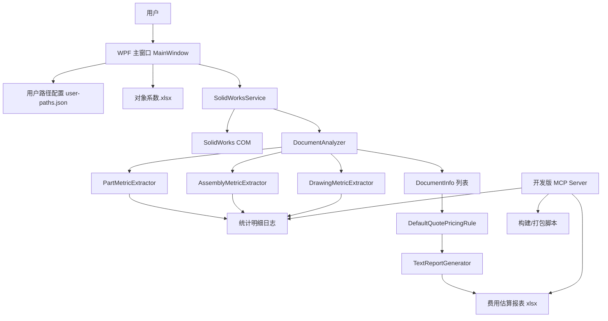
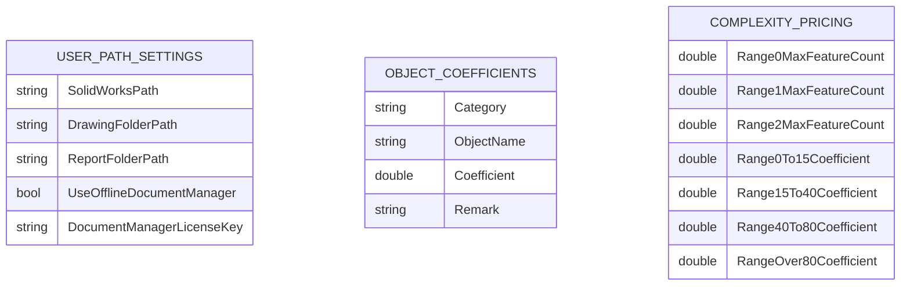
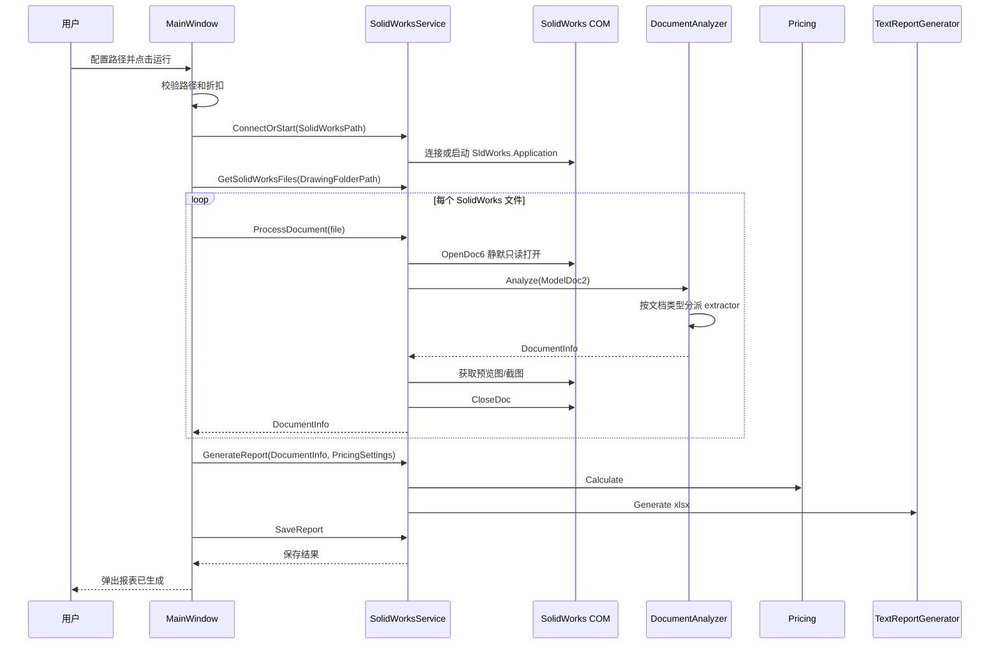
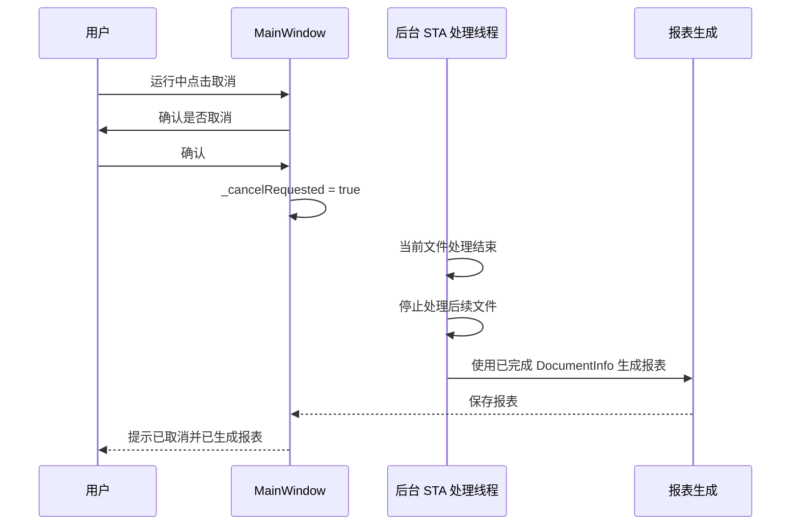
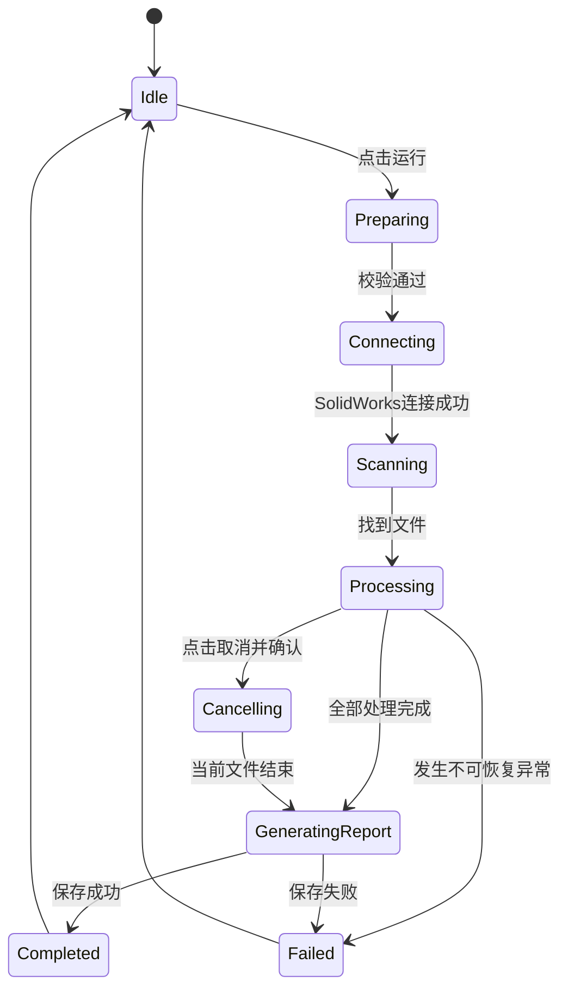

# IPXQuoteTool 开发手册

## 1. 快速开始 (Quick Start)

### 1.1 环境准备

开发环境要求：

- Windows x64
- Visual Studio 2022 或 Rider
- .NET SDK 10.0
- PowerShell
- SolidWorks 客户端
- SolidWorks COM 注册正常
- Node.js 20 LTS 或更高版本，仅开发版 MCP 需要

项目使用 WPF 桌面程序，目标框架为：

```xml
<TargetFramework>net10.0-windows</TargetFramework>
<UseWPF>true</UseWPF>
<UseWindowsForms>true</UseWindowsForms>
<PlatformTarget>x64</PlatformTarget>
```

项目根目录：

```text
C:\Users\GESIC\Desktop\xuhongtao\IPXQuote-mytest\IPXQuotetest
```

首次拉取或拷贝项目后，建议确认以下文件存在：

```text
IPXQuoteTool.csproj
resources\Templates\对象系数.xlsx
lib\SolidWorks\SolidWorks.Interop.sldworks.dll
lib\SolidWorks\SolidWorks.Interop.swconst.dll
lib\SolidWorks\SolidWorks.Interop.swpublished.dll
lib\SolidWorks\SolidWorks.Interop.swdocumentmgr.dll
```

开发版 MCP 依赖安装：

```powershell
cd C:\Users\GESIC\Desktop\xuhongtao\IPXQuote-mytest\IPXQuotetest\tools\mcp\dev
npm.cmd install
```

### 1.2 配置文件修改

用户路径配置文件位于：

```text
%APPDATA%\IPXQuoteTool\user-paths.json
```

对应代码：

```text
src\Settings\UserPathSettings.cs
src\Settings\UserPathSettingsService.cs
```

配置字段：

| 字段 | 说明 |
| --- | --- |
| `SolidWorksPath` | 用户选择的 SolidWorks 安装路径或 `sldworks.exe` 路径 |
| `DrawingFolderPath` | 待分析 SolidWorks 文件目录 |
| `ReportFolderPath` | 费用估算报表输出目录 |
| `UseOfflineDocumentManager` | 离线读取开关，当前 UI 入口隐藏但配置保留 |
| `DocumentManagerLicenseKey` | SolidWorks Document Manager License Key，当前作为后续离线模式测试预留 |

对象系数模板文件：

```text
resources\Templates\对象系数.xlsx
```

运行时复制到程序目录：

```text
对象系数.xlsx
```

主要配置项：

| 配置项 | 当前默认值 | 说明 |
| --- | ---: | --- |
| 单价 | `3.0` | 每等效特征单价 |
| 复杂度系数 | `1.0` | 当前各区间默认均为 1.0 |
| 零件特征系数 | `1.00` | 零件 FeatureManager 特征 |
| 零件配置项系数 | `0.50` | 零件配置数量 |
| 零件表达式系数 | `0.10` | 零件方程式/表达式 |
| 装配组件数系数 | `0.60` | 装配一级组件 |
| 装配约束系数 | `0.80` | SolidWorks 配合，报表中称为装配约束 |
| 装配特征系数 | `1.00` | 装配级特征和虚拟组件零件特征 |
| 工程图视图系数 | `0.80` | 工程图模型视图，不含 Sheet View |
| 工程图标注系数 | `0.50` | 尺寸、中心线、中心标记、普通注释等 |
| 工程图表格系数 | `0.50` | 工程图表格对象 |

### 1.3 启动与验证

开发构建：

```powershell
cd C:\Users\GESIC\Desktop\xuhongtao\IPXQuote-mytest\IPXQuotetest
dotnet build IPXQuoteTool.csproj -c Debug
```

运行程序：

```powershell
dotnet run --project IPXQuoteTool.csproj
```

生成客户 portable 包：

```powershell
powershell -ExecutionPolicy Bypass -File .\publish-portable.ps1
```

生成结果：

```text
artifacts\publish\IPXQuoteTool_Portable\
artifacts\publish\IPXQuoteTool_Portable.zip
```

如果要让客户无需手动下载安装 .NET Desktop Runtime，需要把安装包放在：

```text
packaging\runtime\windowsdesktop-runtime-10.0.10-win-x64.exe
```

当前脚本也兼容历史目录：

```text
packaging\runntime\windowsdesktop-runtime-10.0.10-win-x64.exe
```

验证点：

- 主窗口能正常启动。
- 能选择 SolidWorks 路径、图纸路径、报表路径。
- 点击运行后能连接 SolidWorks。
- 能扫描 `.sldprt`、`.sldasm`、`.slddrw` 文件。
- 能生成 `费用估算_yyyyMMdd_HHmmss.xlsx`。
- 取消按钮只在运行中可用，取消后会基于已完成数据生成报表。
- 报表中包含表头、生成日期、图纸总数、等效特征数、估算总价。

## 2. 项目概览

### 2.1 业务背景

IPXQuoteTool 是一个面向 SolidWorks 数据转换工作的费用估算工具。

核心目标：

- 批量读取 SolidWorks 文件。
- 按文件类型提取对象数量。
- 使用对象系数、复杂度系数、折扣系数和单价计算费用。
- 输出费用估算 Excel 报表。
- 对处理失败或超时的文件保留占位行，便于人工补充。

支持的文件类型：

| 扩展名 | 类型 | 统计重点 |
| --- | --- | --- |
| `.sldprt` | 零件 | 特征、配置项、表达式 |
| `.sldasm` | 装配 | 一级组件、装配约束、装配特征、配置项、表达式 |
| `.slddrw` | 工程图 | 视图、标注、表格 |

### 2.2 技术选型及理由

| 技术 | 用途 | 选择理由 |
| --- | --- | --- |
| WPF | 主程序 UI | 适合 Windows 桌面工具，便于和 SolidWorks 本地环境集成 |
| .NET 10 Windows | 主程序运行时 | 支持现代 C# 和 Windows 桌面能力 |
| SolidWorks COM Interop | 文件读取和指标提取 | SolidWorks 官方桌面自动化接口，能读取真实 FeatureManager、工程图视图和标注 |
| OpenXML 手写 xlsx | 报表生成 | 不依赖 Excel 客户端，发布包更可控 |
| 本地 JSON | 用户路径配置 | 简单、可迁移、无需数据库 |
| xlsx 模板 | 对象系数配置 | 业务人员可直接用 Excel 修改系数 |
| PowerShell | portable 打包 | 适合 Windows 端发布流程和 Runtime 安装包复制 |
| Node.js MCP Server | 开发辅助 | 方便用 AI 客户端读取项目状态、日志、打包结果和统计明细 |

### 2.3 模块划分与包结构

```text
src\UI\
  WPF 主窗口、开发者模式窗口、App 入口

src\Services\
  SolidWorks 连接、文件扫描、文档打开、报表保存、离线读取服务

src\Analysis\
  文档分析协调器、统计明细日志、各类型指标提取器

src\Analysis\Parts\
  零件指标提取和零件特征统计

src\Analysis\Assemblies\
  装配体组件、配合、装配特征统计

src\Analysis\Drawings\
  工程图视图、标注、中心线、表格统计

src\Analysis\Common\
  通用 SolidWorks 指标，例如配置项、表达式

src\Pricing\
  对象系数、复杂度系数、折扣和计价规则

src\Reporting\
  费用估算 xlsx 生成

src\Settings\
  用户路径配置读写

src\Models\
  报价过程数据模型

resources\Templates\
  对象系数模板

lib\SolidWorks\
  SolidWorks Interop DLL

packaging\
  portable 发布脚本和运行时安装包

tools\mcp\dev\
  开发版 MCP Server
```

核心类职责：

| 类 | 职责 |
| --- | --- |
| `MainWindow` | UI 交互、运行状态、取消控制、进度显示 |
| `SolidWorksService` | 连接 SolidWorks、打开文档、截图、分析、保存报表 |
| `DocumentAnalyzer` | 根据文档类型分派到具体 extractor |
| `PartMetricExtractor` | 零件指标提取 |
| `AssemblyMetricExtractor` | 装配指标提取 |
| `DrawingMetricExtractor` | 工程图指标提取 |
| `DefaultQuotePricingRule` | 费用估算规则 |
| `TextReportGenerator` | 生成 xlsx 报表 |
| `ObjectCoefficientSettingsService` | 对象系数 xlsx 的生成和读取 |
| `UserPathSettingsService` | `%APPDATA%` 用户路径配置读写 |
| `AnalysisTraceLogger` | 输出统计明细日志 |

## 3. 设计文档 (Design)

### 3.1 整体架构图



### 3.2 数据库 ER 图 / 表结构说明

当前项目没有数据库。

项目使用两类本地文件保存状态和业务参数：



本地文件说明：

| 文件 | 位置 | 作用 |
| --- | --- | --- |
| `user-paths.json` | `%APPDATA%\IPXQuoteTool\user-paths.json` | 保存用户路径和离线读取预留配置 |
| `对象系数.xlsx` | 程序运行目录 | 保存对象系数；Debug 版本还会读取单价和复杂度系数 |
| `*统计明细_yyyyMMdd_HHmmss.txt` | `%APPDATA%\IPXQuoteTool` | 保存一次运行中的对象统计明细 |
| `费用估算_yyyyMMdd_HHmmss.xlsx` | 用户选择的报表目录 | 输出费用估算结果 |

### 3.3 核心业务流程时序图



取消流程：



### 3.4 状态机流转说明

主窗口运行状态：



按钮状态：

| 状态 | 运行按钮 | 取消按钮 | 输入区域 |
| --- | --- | --- | --- |
| 未运行 | 可用 | 灰显 | 可编辑 |
| 运行中 | 禁用 | 蓝色可用 | 禁用 |
| 正在取消 | 禁用 | 禁用 | 禁用 |
| 运行完成 | 可用 | 灰显 | 可编辑 |

## 4. 接口文档 (API)

### 4.1 对外接口列表 (含示例)

本项目主要是桌面程序，没有传统 HTTP 业务接口。对外可视为三类接口：

#### 4.1.1 用户界面接口

| 入口 | 输入 | 输出 |
| --- | --- | --- |
| 运行 | SolidWorks 路径、图纸目录、报表目录、折扣 | 费用估算 xlsx |
| 取消 | 用户确认 | 已完成数据的费用估算 xlsx |
| 前往报表路径 | 报表目录 | 打开 Windows 文件夹 |
| 运行日志标题连续点击 7 次 | 单文件路径 | 进入开发者单文件模式 |

#### 4.1.2 内部服务接口

`SolidWorksService`：

| 方法 | 说明 |
| --- | --- |
| `ConnectOrStart(string swInstallPath)` | 校验并连接 SolidWorks |
| `GetSolidWorksFiles(string folderPath)` | 递归扫描 SolidWorks 文件 |
| `ProcessDocument(string filePath)` | 打开并分析单个 SolidWorks 文档 |
| `GenerateReport(List<DocumentInfo>, QuotePricingSettings)` | 生成 xlsx 字节内容 |
| `SaveReport(string reportPath, byte[] content)` | 保存报表到指定目录 |

`DocumentAnalyzer`：

| 方法 | 说明 |
| --- | --- |
| `Analyze(ModelDoc2 model)` | 创建 `DocumentInfo` 并根据文档类型调用 extractor |

`IReportGenerator`：

| 方法 | 说明 |
| --- | --- |
| `Generate(IReadOnlyList<DocumentInfo>, QuotePricingSettings)` | 生成费用估算报表 |

#### 4.1.3 开发版 MCP 工具接口

MCP stdio 启动：

```powershell
cd tools\mcp\dev
npm.cmd start
```

MCP HTTP 启动：

```powershell
cd tools\mcp\dev
$env:IPX_MCP_HOST="0.0.0.0"
$env:IPX_MCP_PORT="3001"
$env:IPX_MCP_TOKEN="组内口令"
npm.cmd run start:http
```

健康检查：

```text
GET http://开发主机IP:3001/health
```

MCP endpoint：

```text
POST http://开发主机IP:3001/mcp
Authorization: Bearer 组内口令
```

可用工具：

| 工具 | 说明 |
| --- | --- |
| `ipx.project_summary` | 返回项目路径和 MCP 状态 |
| `ipx.build` | 执行 `dotnet build` |
| `ipx.publish_portable` | 执行 portable 打包并检查结果 |
| `ipx.inspect_portable_zip` | 检查 portable 压缩包内容 |
| `ipx.check_object_coefficients` | 检查对象系数和默认单价 |
| `ipx.read_recent_trace` | 读取最近统计明细 |
| `ipx.check_duplicate_metrics` | 检查统计明细重复项 |

组员客户端配置示例：

```json
{
  "mcpServers": {
    "ipx-dev-team": {
      "url": "http://192.168.19.249:3001/mcp",
      "headers": {
        "Authorization": "Bearer 组内口令"
      }
    }
  }
}
```

### 4.2 错误码对照表

程序本身主要通过异常信息、日志和 SolidWorks 打开文件错误码表达失败原因。

常见 SolidWorks 打开失败：

| 错误类型 | 用户提示 | 处理建议 |
| --- | --- | --- |
| 版本不匹配 | 当前 SolidWorks 版本过低，无法打开更高版本图纸 | 使用更高版本 SolidWorks 打开 |
| 文件不存在 | 文件不存在或路径不可访问 | 检查路径、网络盘、权限 |
| 文件类型无效 | 文件类型无效或格式不受支持 | 确认扩展名和文件格式 |
| 文件需要修复 | 文件需要修复后才能打开 | 用 SolidWorks 手动打开并修复 |
| 严重数据损坏 | 文件存在严重数据损坏 | 人工排查图纸 |
| 系统资源不足 | SolidWorks 无法打开文件 | 关闭其他程序或重启 SolidWorks |
| SolidWorks 繁忙 | SolidWorks 当前繁忙，无法打开文件 | 等待或重启 SolidWorks |
| 文件被占用 | 文件被其他程序占用或无访问权限 | 释放文件占用、检查权限 |
| 只读或已有同名文件 | 文件只读、已经打开或有同名文件打开 | 关闭冲突文件后重试 |
| 超时 | 单文件处理超过 5 分钟 | 程序保留失败占位行，后续人工排查 |

MCP HTTP 常见错误：

| 错误 | 含义 | 处理建议 |
| --- | --- | --- |
| `401 Unauthorized` | token 缺失或错误 | 检查 `Authorization: Bearer` 或 URL token |
| `Invalid Host` | Host 校验失败 | 确认 `IPX_MCP_HOST=0.0.0.0` 并使用新版 `http-server.js` |
| 连接超时 | 端口不通 | 检查服务是否启动、防火墙、IP、端口 |
| `Bad Request: initialize first` | MCP 会话未初始化 | 使用支持 MCP Streamable HTTP 的客户端 |

## 5. 配置说明 (Configuration)

### 5.1 环境变量列表

主程序没有强依赖环境变量，主要依赖 UI 输入和本地配置文件。

开发版 MCP 环境变量：

| 环境变量 | 默认值 | 说明 |
| --- | --- | --- |
| `IPX_MCP_HOST` | `127.0.0.1` | HTTP MCP 监听地址，远程访问用 `0.0.0.0` |
| `IPX_MCP_PORT` | `3001` | HTTP MCP 监听端口 |
| `IPX_MCP_TOKEN` | 空 | HTTP MCP 访问 token，组内远程使用时必须配置 |

发布脚本参数：

| 参数 | 默认值 | 说明 |
| --- | --- | --- |
| `Configuration` | `Release` | 发布配置 |
| `Runtime` | `win-x64` | 目标运行时 |
| `SelfContained` | `false` | 是否生成自包含大包 |

### 5.2 核心业务参数调优说明

对象系数文件：

```text
对象系数.xlsx
```

计价公式：

```text
估算价格 = 等效特征数 * 单价 * 复杂度系数 * 文件类型折扣
```

等效特征数：

```text
等效特征数 = 各对象数量 * 对应对象系数 之和
```

折扣输入规则：

- UI 输入范围：`0.4` 到 `1.0`
- 步进：`0.1`
- 失焦或按回车时自动格式化

复杂度区间：

| 区间 | 默认最大特征数 | 默认复杂度系数 |
| --- | ---: | ---: |
| 0-15 | 15 | 1.0 |
| 16-40 | 40 | 1.0 |
| 41-80 | 80 | 1.0 |
| 80 以上 | 无上限 | 1.0 |

调参建议：

- 对象系数用于表达不同对象统计项的工作量权重。
- 单价用于整体费用水平调整，当前默认内置值为 3.0。
- 复杂度系数用于表达大文件或复杂文件的额外成本。
- Debug 版本会从 `对象系数.xlsx` 读取单价和复杂度系数，便于开发调试。
- Release 版本固定使用程序内置单价和复杂度系数，不允许通过 `对象系数.xlsx` 调整这些报价基准参数。
- 文件类型折扣用于临时批量折扣或类型折扣，不建议长期替代对象系数。

## 6. 运维与监控 (Ops)

### 6.1 日志格式与查看方式

主窗口运行日志：

- 显示在 WPF 主窗口“运行日志”区域。
- 包含启动、路径、连接、处理开始、处理完成、失败原因、取消、报表生成结果。

统计明细日志：

```text
%APPDATA%\IPXQuoteTool\*统计明细_yyyyMMdd_HHmmss.txt
```

日志字段以 Tab 分隔：

| 字段 | 说明 |
| --- | --- |
| 时间 | `HH:mm:ss` |
| 文档路径 | 当前 SolidWorks 文件路径 |
| 对象类型 | 如 `标注:中心线`、`表格`、`装配约束` |
| 对象名称 | SolidWorks 对象名称或程序生成的占位名称 |
| 详情 | 来源视图、API 来源、图层等补充信息 |

开发版 MCP 可直接读取和分析最近统计明细：

```text
用 IPX MCP 读取最近工程图统计明细。
用 IPX MCP 检查最近中心线统计有没有重复。
```

### 6.2 关键监控指标

运行过程建议关注：

| 指标 | 来源 | 说明 |
| --- | --- | --- |
| 扫描文件数 | 主窗口日志 | 本次待处理文件数量 |
| 已处理文件数 | 进度条 | 当前进度 |
| 零件/装配/工程图数量 | 主窗口统计 | 文件类型分布 |
| 单文件处理耗时 | 主窗口日志 | 排查慢文件和超时文件 |
| 失败文件数 | 报表占位行和日志 | 需要人工处理的文件 |
| 超时文件数 | 主窗口日志 | 可能存在损坏、版本不匹配或 SolidWorks 卡死 |
| 统计明细重复项 | MCP 工具 | 排查重复统计问题 |
| portable 包完整性 | MCP 工具 | 发包前检查 |

### 6.3 常见问题排查 (FAQ)

#### Q1：启动后提示未找到 SolidWorks

检查：

- UI 中选择的路径是否包含 `sldworks.exe`。
- SolidWorks 是否已正确安装。
- `HKEY_CLASSES_ROOT\SldWorks.Application\CLSID` 是否存在。

#### Q2：选择的 SolidWorks 版本和系统默认版本不一致

程序会提示是否修改系统默认 `SldWorks.Application` 指向。

该操作会请求管理员权限，并修改：

```text
HKEY_CLASSES_ROOT\SldWorks.Application\CLSID
```

如果用户拒绝，程序会停止运行，避免连接到错误版本的 SolidWorks。

#### Q3：某个图纸处理很久

单文件处理超过 5 分钟会被判定为超时。

程序会：

- 跳过当前文件。
- 尝试终止对应 SolidWorks 进程。
- 在报表中保留失败占位行。
- 继续处理后续文件。

#### Q4：取消后为什么还会生成报表

这是设计行为。

取消只停止后续文件处理，不丢弃已完成数据。程序会基于取消时点已经分析完成的 `DocumentInfo` 列表生成费用估算表。

#### Q5：工程图普通注释为什么有筛选

普通注释既可能挂在模型视图上，也可能直接位于 Sheet View。统计逻辑不能简单排除 Sheet View。

当前筛选原则：

- 必须是可见注释。
- 必须属于 DrawingView 或 DrawingSheet。
- 不统计图纸模板背后的系统注释。
- 不统计锁定位置或隐藏在图纸背后的注释。
- 不统计 BOM balloon。
- 不统计属性链接类系统文本。

#### Q6：工程图中心线统计包含哪些对象

当前尽量覆盖：

- 中心线
- 中心标记
- 中心符号线

实现上会从多个 SolidWorks API 来源收集，再按对象类型和对象名称去重，避免同一中心对象从 `View`、`AnnotationChain`、`CenterMarkChain` 多个入口被重复统计。

#### Q7：客户电脑没有 .NET 10 怎么办

portable 包启动器会检测 `.NET 10 Desktop Runtime x64`。

如果发布包内包含：

```text
runtime\windowsdesktop-runtime-10.0.10-win-x64.exe
```

启动器会提示用户确认后自动调用本地安装包。

如果没有本地安装包，会尝试 `winget`，失败后打开微软官方下载页。

#### Q8：离线读取开关在哪里

当前离线读取入口在 UI 上隐藏，代码和配置保留。

相关配置：

```text
%APPDATA%\IPXQuoteTool\user-paths.json
```

相关代码：

```text
src\Services\OfflineDocumentManagerService.cs
src\Settings\UserPathSettings.cs
```

后续需要测试离线读取时，可重新打开 UI 入口并配置 Document Manager License Key。

#### Q9：开发者单文件模式怎么进入

在主窗口连续点击“运行日志”标题 7 次，可打开开发者模式窗口。

开发者模式用于单文件调试，便于排查某一张图纸、某一个装配或某一个零件的统计逻辑。

#### Q10：发包前应该检查什么

推荐检查：

```powershell
dotnet build IPXQuoteTool.csproj -c Release
powershell -ExecutionPolicy Bypass -File .\publish-portable.ps1
```

或通过 MCP：

```text
用 IPX MCP 检查 portable 包能不能发客户。
```

确认：

- `IPXQuoteTool_Portable.zip` 存在。
- 压缩包内包含 `IPXQuoteTool.exe`。
- 压缩包内包含 `对象系数.xlsx`。
- 压缩包内包含启动脚本。
- 小包版如需免联网安装 .NET，应包含 runtime 安装包。

## 9. 离线读取模式技术验证汇报

### 9.1 验证背景

本次对 SolidWorks Document Manager 离线读取模式进行了探索性验证。离线模式的目标是在不启动 SolidWorks 主程序的情况下，直接读取 SolidWorks 文件信息，用于提升批量报价场景下的启动速度和运行稳定性。

当前程序已支持在界面勾选“离线读取（Document Manager）”后输入并保存 Document Manager License Key。密钥保存到：

```text
%APPDATA%\IPXQuoteTool\user-paths.json
```

再次启用离线读取时，如果配置文件中已存在密钥，则无需重复输入。

### 9.2 验证结论

经实际图纸数据验证，离线读取模式输出的信息准确率明显低于正常 SolidWorks 模式，当前不适合作为正式报价功能投入使用。

正常模式通过 SolidWorks 主程序打开文档，可获取更完整的模型、工程图视图、注释、特征、属性和上下文信息，统计结果更稳定、更接近人工检查结果。

离线读取模式虽然可以在不启动 SolidWorks 的情况下读取部分文档信息，但 Document Manager API 能访问的数据范围有限，对工程图、特征树、视图上下文、部分注释和复杂模型信息的支持不足，导致统计结果存在较大偏差。

### 9.3 主要问题

- 部分图纸和模型信息无法完整读取。
- 工程图相关统计与正常模式差异较大。
- 零件特征、视图上下文、部分注释对象等信息存在缺失。
- 不同文件类型、不同 SolidWorks 版本保存的文件，离线读取表现不完全一致。
- 输出结果稳定性不足，无法满足正式报价对准确率的要求。

### 9.4 后续处理建议

离线读取模式保留为技术探索能力，不作为客户正式使用路径。

正式报价流程仍以正常 SolidWorks 模式为准，即启动或连接 SolidWorks 后进行文件读取、统计和报表生成。

如后续继续研究离线读取，可仅将其用于辅助场景，例如快速预扫描文件列表、读取基础文件属性、判断文件类型或做开发调试参考，不建议用于最终报价数据生成。
